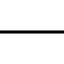

# JS Slider - project

My contacts: 
- telegram - https://www.t.me/kznws
- facebook - https://www.facebook.com/AlexanderKuznecov11

Links: 
- template - https://www.figma.com/file/D4rkmpfIjEC3GwYBPgE1vd/Slider?type=design&node-id=2-42&t=GOYr1RQ4SgQ1g23U-0
- website - https://js-slider-eight.vercel.app/

## Task
```
Это ваш третий проект, который направлен на отработку навыков разработки на JavaScript.

В рамках этого проекта вам нужно сделать слайдер* для сайта. Это автономная часть которую можно в дальнейшем внедрить в рабочий сайт. 

Ваша основная задача — преобразовать внешний вид сайта, так чтобы на нем менялись изображения и информация об объекте. Примерный вариант решения задачи можно посмотреть здесь.

Откройте и изучите макет.

Управляющие элементы, которые вам нужно установить и которые являются условиями проекта:

    1) Стрелки (переключают слайды по кольцу. То есть после слайда №3 снова пойдет слайд №1);
    2) Кружочки между стрелками (включают нужный слайд);
    3) Ссылки сверху слайдера (включают нужный слайд).
```

## My solution
# 1) Подготовка к работе
Перед тем как начать делать задание нужно распределить папки, где будут картинки, где скрипты, где стили и так далее. Лично я создал такие папки как __scripts__ где будет находиться наш js, папку __style__ где хранятся наши стили, а также папка __img__ где хранятся наши изображения, ну и само собой файл __index.html__ находится вне какой либо папки.

# 2) HTML
На наш сайт я добавил библиотеку иконок с сайта fontawesome.com , которые очень пригодились. В самом __body__ я сделал блок __wrapper__, который оборачивает весь сайт.
Внутри него контейнер, который ограничивает содержимое максимальной шириной. В самом контейнере я сделал блок __wrapper__inner__, который содержит весь контент и с помощью `display: flex` делит наш сайт на 2 части, тем самым делая его гибким.
И перед закрытие тега __body__ я добавил ссылку на скрипт из папки __scripts__.

```
<!DOCTYPE html>
<html lang="en">
<head>
    <meta charset="UTF-8">
    <meta name="viewport" content="width=device-width, initial-scale=1.0">
    <title>Desktop slider</title>
    <link rel="stylesheet" href="style/style.css">
    <script src="https://kit.fontawesome.com/39bbe9b596.js" crossorigin="anonymous"></script>
</head>
<body>
    <div class="wrapper">
        <div class="container">
            <div class="wrapper__inner">
                <div class="wrapper__item">
                    <div class="item-title">
                        <h2 class="item-title">Completed<br>projects</h2>
                        
                    </div>
                    <p class="item-text">Only a small part of the work performed by our company is presented<br>on the site. For 14 years on in the construction<br>market we have made happy more than 1000 families</p>
                    <div class="item-information">
                        <div class="item-info">
                            <div class="info-item">
                                <h4 class="info-item-name">City:</h4>
                                <p id="city" class="info-item-text">Rostov-on-Don<br>LCD admiral</p>
                            </div>
                            <div class="info-item pd-left">
                                <h4 class="info-item-name">Apartment area:</h4>
                                <p id="apArea" class="info-item-text">81 m2</p>
                            </div>
                        </div>
                        <div class="item-info">
                            <div class="info-item">
                                <h4 class="info-item-name">Repair time:</h4>
                                <p id="repTime" class="info-item-text">3.5 months</p>
                            </div>
                            <div class="info-item">
                                <h4 class="info-item-name">Repair cost:</h4>
                                <p id="repCost" class="info-item-text">Upon request</p>
                            </div>
                        </div>
                    </div>
                    <div class="slider">
                        <i id="prevSlideOpen" title="Open previous slide" class="arrow fa-solid fa-arrow-left-long"></i>
                        <div class="slider-dots">
                            <i id="dot1" class="fa-solid fa-circle active"></i>
                            <i id="dot2" class="fa-solid fa-circle"></i>
                            <i id="dot3" class="fa-solid fa-circle"></i>
                        </div>
                        <i id="nextSlideOpen" title="Open next slide" class="arrow fa-solid fa-arrow-right-long"></i>
                    </div>
                </div>
                <div class="wrapper__item">
                    <nav class="wrapper__nav">
                        <a id="link1" href="#" class="active">Rostov-on-Don, Admiral</a>
                        <a id="link2" href="#">Sochi Thieves</a>
                        <a id="link3" href="#">Rostov-on-Don Patriotic</a>
                    </nav>
                    
                </div>
            </div>
        </div>
        <!-- /.container -->
    </div>
    <!-- /.wrapper -->

    <script src="scripts/app.js"></script>
</body>
</html>
```

# 3) CSS
Самое главное здесь это то, что у точки в слайдере и у ссылки есть класс __active__, который делает элемент более видным, опознаваемым. (Этот класс будет добавляться и удаляться в зависимости от нажатия... (js))

```
@import url('https://fonts.googleapis.com/css2?family=Nunito+Sans&family=Yeseva+One&display=swap');

body,html{
    width: 100%;
    min-height: 100vh;
    overflow: hidden;
    margin: 0;
    padding: 0;
    font-weight: 400;
    font-family: 'Nunito Sans', sans-serif;
}

*{
    margin: 0;
    padding: 0;
    border: none;
    outline: none;
    text-decoration: none;
    box-sizing: border-box;
}

.container{
    max-width: 1171px;
    width: 100%;
    margin: 0 auto;
}

i,a,img{
    transition: .2s ease;
    cursor: pointer;
}

h2,h4{
    text-transform: uppercase;
    font-family: 'Yeseva One', cursive !important;
    color: #E3B873;
}


.wrapper {
    width: 100%;
    height: 100vh;
    background-color: #000;
}
.wrapper__inner{
    display: flex;
    justify-content: center;
    align-items: center;
    padding-top: 107px;
    padding-bottom: 124px;
    column-gap: 50px;
}
.wrapper__item {
    color: #fff;
}
.item-title{
    display: flex;
    justify-content: flex-start;
    align-items: flex-end;
}
.item-title h2 {
    font-size: 27px;
    line-height: 37px;
    letter-spacing: -0.07em;
}
.item-title img{
    height: 1px;
    width: 92px;
    background-color: #E3B873;
    margin-bottom: 24px;
}
.item-text {
    font-size: 14px;
    line-height: 27px;
    padding-bottom: 42px;
    padding-top: 34px;
}
.item-information{
    display: flex;
    flex-direction: column;
    row-gap: 34px;
    padding-bottom: 92px;
}
.item-info {
    display: flex;
    column-gap: 34px;
}
.item-info .pd-left{
    padding-left: 34px;
}
.info-item-name {
    font-size: 18px;
    line-height: 25px;
    padding-bottom: 9px;
}
.info-item-text {
    font-size: 13px;
    line-height: 21px;
}
.slider {
    display: flex;
    column-gap: 29.5px;
    align-items: center;
}
.arrow {
    font-size: 20px;
}
.arrow:hover{
    color: #E3B873;
}
.slider-dots {
    display: flex;
    column-gap: 17.5px;
}
.slider-dots i{
    font-size: 14px;
    color: rgba(255, 255, 255, 0.3);
}
.slider-dots i.active{
    color: #fff;
}
.fa-circle:hover {
    opacity: .7;
}
.wrapper__nav {
    padding-bottom: 45px;
    display: flex;
    column-gap: 60.5px;
}
.wrapper__nav a{
    padding-bottom: 6px;
    border-bottom: 1px solid transparent;
    font-size: 14px;
    line-height: 19px;
    text-transform: uppercase;
    color: rgba(255, 255, 255, 0.3);
    font-family: 'Yeseva One', cursive;
}
.wrapper__nav a:hover{
    color: #E3B873;
    border-color: #E3B873;
}

.wrapper__nav a.active{
    color: #E3B873;
    border-color: #E3B873;
}

.item-img{
    height: 482px;
    width: 679px;
}
```

## 4) JS
Самое первое, что я сделал - это было создание объекта, который содержит все данные, которые будут на сайте меняться при клике. Затем я создал переменные для навигации и для информации, которую нужно будет менять.
У нас есть переменная `currentSlide`, которая отвечает за то, какую информацию будет доставать из __slideData__ объекта (Если __currentSlide__ равен 0 то будем менять информацию сайта на те значения, которые есть в __slideData__ по индексу).
Функция `getText()` меняет содержимое сайта, функция `dotCheck()` проверяет какой слайд (если первый, то первой точке добавляем класс __active__). Функция `navLinkCheck()` делает тоже самое, что и `dotCheck`, но проверяет уже навигацию сайта.
Функция `animation()` создаёт анимацию для картинки и вызывает все выше названные функции с задержкой в 2 200мс.

По поводу __events__. При нажатии на стрелку, которая включает предыдущий слайд (`prevlideOpener.addEventListener`) вычитается 1 у __currentSlide__, но если нажав назад у первого слайда и то открывается последний слайд и вызывает функция `animation()`.
Также само с стрелкой, которая включает следующий слайд (`nextSlideOpener.addEventListener`), она прибавляет 1 к __currentSlide__, но если уже будет включен последний слайд то откроется самый первый.
За этими ивентами проверяется точка и ссылка и при нажатии проверяем индекс и запускаем функцию `animation()`.
```
const slideData = [
    {
        city: 'Rostov-on-Don<br>LCD admiral',
        area: '81 m2',
        time: '3.5 months',
        cost: 'Upon request',
        img: 'img/slide1.png'
    },
    {
        city: 'Sochi<br>Thieves',
        area: '105 m2',
        time: '4 months',
        cost: 'Upon request',
        img: 'img/slide2.png'
    },
    {
        city: 'Rostov-on-Don<br>Patriotic',
        area: '93 m2',
        time: '3 months',
        cost: 'Upon request',
        img: 'img/slide3.png'
    },
];

// navigation variables
const prevSlideOpener = document.getElementById('prevSlideOpen'),
      nextSlideOpener = document.getElementById('nextSlideOpen'),
      dotLink1 = document.getElementById('dot1'),
      dotLink2 = document.getElementById('dot2'),
      dotLink3 = document.getElementById('dot3'),
      navLink1 = document.getElementById('link1'),
      navLink2 = document.getElementById('link2'),
      navLink3 = document.getElementById('link3');
    
// html info variables
const cityName = document.getElementById('city'),
      apartmentArea = document.getElementById('apArea'),
      repairTime = document.getElementById('repTime'),
      repairCost = document.getElementById('repCost'),
      image = document.getElementById('slideImg');

// current slide variable
let currentSlide = 0;


// function change variables texts
function getText(){
    cityName.innerHTML = slideData[currentSlide].city;
    apartmentArea.innerHTML = slideData[currentSlide].area;
    repairTime.innerHTML = slideData[currentSlide].time;
    repairCost.innerHTML = slideData[currentSlide].cost;
    image.setAttribute('src', slideData[currentSlide].img);
};

// function change styles for dots
function dotCheck(){
    if(currentSlide === 0){
        dotLink1.classList.add('active');
        dotLink2.classList.remove('active');
        dotLink3.classList.remove('active');
    } else if (currentSlide === 1){
        dotLink2.classList.add('active');
        dotLink1.classList.remove('active');
        dotLink3.classList.remove('active');
    } else{
        dotLink3.classList.add('active');
        dotLink1.classList.remove('active');
        dotLink2.classList.remove('active');
    };
};

// function change style for links
function navLinkCheck(){
    if(currentSlide === 0){
        navLink1.classList.add('active');
        navLink2.classList.remove('active');
        navLink3.classList.remove('active');
    } else if (currentSlide === 1){
        navLink2.classList.add('active');
        navLink1.classList.remove('active');
        navLink3.classList.remove('active');
    } else{
        navLink3.classList.add('active');
        navLink1.classList.remove('active');
        navLink2.classList.remove('active');
    };
};

// Function what do animation
function animation(){
    image.style.opacity = 0;
    setTimeout(() => {
        image.style.opacity = 1;
        getText();
        dotCheck();
        navLinkCheck();
    }, 200);
};


// event on click previous slide
prevSlideOpener.addEventListener('click', () => {
    currentSlide -= 1;
    if(currentSlide < 0){
        currentSlide = (slideData.length - 1);
    };
    animation();
});

// event on click next slide
nextSlideOpener.addEventListener('click', () => {
    currentSlide += 1;
    if(currentSlide > (slideData.length - 1)){
        currentSlide = 0;
    };
    animation();
});


// link navigation
navLink1.addEventListener('click', () => {
    currentSlide = 0;
    animation();
});

navLink2.addEventListener('click', () => {
    currentSlide = 1;
    animation();
});

navLink3.addEventListener('click', () => {
    currentSlide = 2;
    animation();
});


// dot navigation
dotLink1.addEventListener('click', () => {
    currentSlide = 0;
    animation();
});

dotLink2.addEventListener('click', () => {
    currentSlide = 1;
    animation();
});

dotLink3.addEventListener('click', () => {
    currentSlide = 2;
    animation();
});
```
